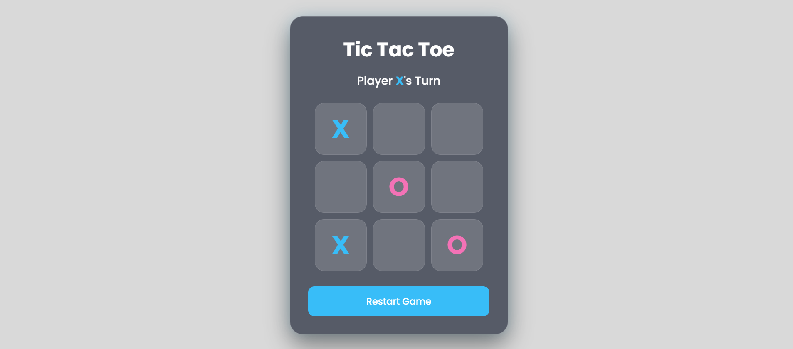
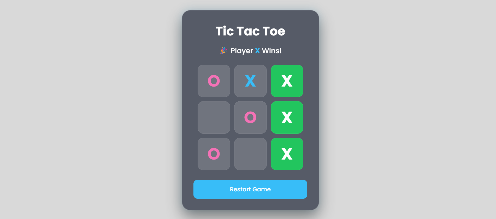

# 🎮 Tic Tac Toe

<div align="center">


A modern and responsive **Tic Tac Toe** game built using **HTML**, **CSS**, and **Vanilla JavaScript**.  
Designed with a clean UI, smooth animations, and an enjoyable user experience.

</div>

---

## 📖 Overview

This project is a classic **Tic Tac Toe** game featuring an elegant glassmorphism-inspired interface and interactive animations. Players can take turns placing **X** and **O**, while the game automatically detects wins, draws, and updates the game status in real time.

The project demonstrates fundamental web development concepts including:

- DOM Manipulation
- Event Handling
- CSS Grid
- Responsive Design
- JavaScript Game Logic
- UI Animations

---

# ✨ Features

- 🎨 Modern Glassmorphism UI
- 📱 Fully Responsive Design
- ⚡ Smooth Hover & Click Animations
- 🏆 Automatic Winner Detection
- 🤝 Draw Detection
- 🔄 Restart Game Button
- 🎯 Real-time Player Turn Indicator
- 💡 Beginner-Friendly Code Structure
- 🚀 Lightweight (No External JavaScript Libraries)

---

# 📂 Project Structure

```text
tic-tac-toe/
│
├── index.html
├── style.css
├── script.js
└── README.md
```

---

# 🛠️ Technologies Used

| Technology | Purpose |
|------------|---------|
| HTML5 | Structure |
| CSS3 | Styling & Animations |
| JavaScript (ES6) | Game Logic |

---

# 🎮 How to Play

1. Open the game in your browser.
2. Player **X** starts first.
3. Players take turns placing **X** and **O**.
4. The first player to align three symbols horizontally, vertically, or diagonally wins.
5. If all cells are filled without a winner, the game ends in a draw.
6. Click the **Restart Game** button to play again.

---

# 🚀 Getting Started

## Clone the Repository

```bash
git clone https://github.com/pokhrelsamir/TicTacToe.git
```

## Navigate to the Project

```bash
cd tic-tac-toe
```

## Run the Project

Simply open **index.html** in your preferred web browser.

No installation or dependencies required.

---

# 📸 Screenshots

> Add screenshots here after completing the project.

```
screenshots/

├── home.png
├── gameplay.png
└── winner.png
```

Example:

```markdown
[Home](screenshots/home.png)




```

---

# 🧠 Game Logic

The game works by:

- Maintaining a 9-cell game board.
- Alternating turns between **X** and **O**.
- Checking all possible winning combinations after every move.
- Highlighting the winning cells.
- Declaring a draw if no empty cells remain.
- Allowing the board to reset instantly.

---

# 💻 Future Improvements

- 🤖 Single Player Mode (AI)
- 🎵 Sound Effects
- 🌙 Dark / Light Theme
- 📊 Scoreboard
- 💾 Local Storage Support
- 🌐 Online Multiplayer
- 🎉 Confetti Animation
- ⏳ Turn Timer
- 🏅 Match History

---

# 📚 Learning Outcomes

This project helped in understanding:

- HTML Page Structure
- CSS Grid Layout
- Flexbox
- Responsive Web Design
- JavaScript Arrays
- DOM Manipulation
- Event Listeners
- Conditional Logic
- Game State Management

---

# 🤝 Contributing

Contributions are welcome!

If you'd like to improve this project:

1. Fork the repository
2. Create a new branch

```bash
git checkout -b feature-name
```

3. Commit your changes

```bash
git commit -m "Add new feature"
```

4. Push to your branch

```bash
git push origin feature-name
```

5. Open a Pull Request

---

# ⭐ Show Your Support

If you found this project helpful, consider giving it a ⭐ on GitHub.

It helps motivate future improvements and supports the project.

---

# 📄 License

This project is licensed under the **MIT License**.

Feel free to use, modify, and distribute it for educational and personal purposes.

---

<div align="center">

### 👨‍💻 Developed by

# **Samir Pokhrel**

### Thank you for visiting!

⭐ Happy Coding ⭐

</div>
